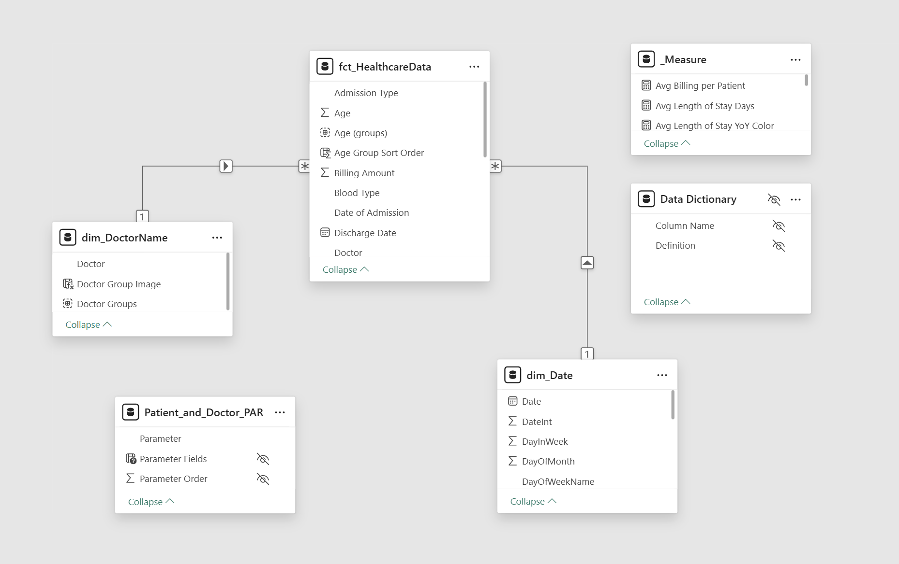
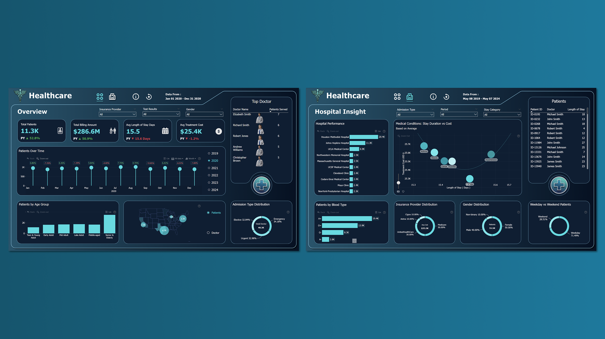

# Healthcare

 

## 1. Introduction

As part of a national healthcare oversight initiative, a comprehensive analysis was conducted using a dataset containing **55,500 unique patient records** from **10 major hospitals across the United States**. The dataset provides valuable insights into **hospital admissions, medical conditions, medications, insurance providers, and treatment costs**.

The goal is to **uncover actionable insights** that support improved healthcare decisions, cost optimization, and better patient outcomes. A dynamic Power BI dashboard was developed to:
- Visualize patterns in patient care across institutions.
- Identify key demographic and clinical trends.
- Empower stakeholders to make informed, data-driven decisions.

## 2. Problem Statement

The healthcare oversight organization aims to understand:
- Which demographic groups are most commonly admitted to hospitals?
- What are the most diagnosed medical conditions and how do they vary across patients?
- How do treatment costs and hospital stays differ by condition and hospital?
- How does insurance provider distribution relate to billing and patient outcomes?
- Are there regional variations in patient care quality and healthcare costs?

## 3. Skills Demonstrated

- Data Cleaning and Transformation (Power Query)
- Data Modeling (Star Schema)
- DAX Calculations and KPIs
- Advanced Power BI Visualizations
- Dynamic Filtering
- Business Insight Generation
- Dashboard Design for Decision Making

## 4. Data Sourcing

The dataset consists of synthetic but realistic healthcare records and includes the following key tables:
- `fct_HealthcareData`: Fact table containing patient-level medical records.
- `dim_DoctorName`: Dimension table with doctor information and visuals.
- `dim_Date`: Calendar table to support time intelligence.

Each record includes: Patient ID, Admission Date, Medical Condition, Medication, Test Result, Insurance Provider, Hospital, Treatment Cost, Length of Stay, Admission Type, and more.

The Dataset Provide by **Onyx Data** 

More Information About This Challenge: [Onyx Data April 2025 Challenge](https://zoomcharts.com/en/microsoft-power-bi-custom-visuals/challenges/onyx-data-april-2025)

## 5. Data Transformation

Data was cleaned and shaped in Power BI using Power Query. Key transformation steps:
- Converted data types for accurate calculations.
- Extracted year, month, and day from admission dates.
- Created categorical age groups and gender breakdown.
- Managed missing values in dimension tables and created hierarchies.
- Generated custom columns (e.g., Weekday vs Weekend, Age Range, Length of Stay).

  - 

  - 
 
- Calculate Total & Average (e.g., Patients, Doctor, Billing Amount, Treatment Cost)

  - 

- Calculate YoY (e.g., Patients, Length of Stay, Billing Amount, Treatment Cost)

  - 

## 6. Data Modeling

A `Star Schema` relational data model was designed in Power BI with the following structure:

- Adopted **Star Schema** with `fct_HealthcareData` as the central fact table.
- Established relationships with `dim_Date` and `dim_DoctorName` for optimized DAX calculations.
- Enabled time intelligence with a fully developed date table.

 

## 7. Analyze & Visualization

The Power BI dashboard consists of **two main pages**:

### Page 1: **Overview**
- Patient demographics (age group, gender, blood type).
- Admission type distribution (emergency, urgent, elective).
- Top hospitals by patient count.
- KPI cards (e.g., Total Patients, Total Bill Amount, Avg Cost, Avg Stay).

### Page 2: **Hospital Insight**
- Avg Length of Stay vs Avg Treatment Cost per Condition.
- Most diagnosed conditions (Hypertension, Diabetes, Obesity, and More).
- Test Result Distribution (Abnormal, Inclusive, Normal).
- Medication consistency by condition.
- Hospital and insurance company performance breakdown.

Dynamic filters for year, month, condition, admission type, and insurance provider allow for flexible insights exploration.

You can interact with report here [Onyx Data](https://app.powerbi.com/view?r=eyJrIjoiZmU5YmE2MzAtYTVkZi00ODkwLTgzMmQtNDViZWJjM2VlZjUwIiwidCI6IjQ2NTRiNmYxLTBlNDctNDU3OS1hOGExLTAyZmU5ZDk0M2M3YiIsImMiOjl9)

 

### Insights

### Demographics Insight
- Most patients fall into the "Senior & Elderly" age group.
- Gender distribution is fairly balanced: 50% Female, 40% Male, 10% Non-binary.

### Patterns of Medical Conditions
- Most common medical conditions:
  - Hypertension (25%)
  - Diabetes (25%)
  - Obesity (23%)
- These conditions also lead to higher treatment costs and longer hospital stays.

### Admission & Patient Flow
- Admission types are evenly distributed:
  - Emergency: 34%
  - Urgent: 33%
  - Elective: 33%
- 71.5% of patients were admitted on weekdays, indicating higher weekday operational demand.

### Hospital Performance
- Highest patient volumes recorded at:
  - Houston Methodist Hospital: 20.4K
  - Johns Hopkins Hospital: 11.3K
- A notable gap exists between high- and mid-tier hospitals in terms of patient volume.

### Cost & Treatment
- Average treatment cost is $25.5K.
- Medicare covers 50% of patients, followed by UnitedHealthCare (30%).

### Length of Stay & Conditions
- Average hospital stay is 15.5 days.
- Asthma, Obesity, and Hypertension are associated with longer stays and higher costs.

### Medical Test Results
- Test result distribution:
  - Abnormal: 55%
  - Inconclusive: 35%
  - Normal: 10%
- The high percentage of abnormal outcomes is a key concern for quality of care.

---

## 8. Conclusion

The analysis reveals:
- The patient population is primarily composed of older adults, frequently diagnosed with chronic conditions like hypertension, diabetes, and obesity.
- A majority of patients receive abnormal or inconclusive test results, highlighting potential diagnostic quality issues.
- High-performing hospitals, such as Houston Methodist, can serve as benchmarks for others.
- Chronic conditions drive both elevated costs and longer stays, reinforcing the need for targeted intervention.

### Recommendations:
1. **Chronic Disease Management Programs**
   - Implement targeted care programs for hypertension, diabetes, and obesity across hospitals.
   - Promote medical staff engagement and patient education to enhance awareness and prevention.

2. **Improve Diagnostic Accuracy**
   - Evaluate testing procedures and validate diagnostic tools due to the high rate of abnormal and inconclusive outcomes.
   - Provide regular training for medical teams to improve diagnosis accuracy.

3. **Optimize Treatment & Operational Efficiency**
   - Standardize care protocols for high-cost, high-stay conditions.
   - Adjust staffing and resources based on weekday admission trends to better match demand.

4. **Benchmark High-Volume Hospitals**
   - Investigate management practices from top performers like Houston Methodist.
   - Develop knowledge-sharing systems to reduce performance gaps across institutions.

5. **Review Insurance Partnerships**
   - Reassess claim processing workflows with Medicare and UnitedHealthCare to streamline approvals and reduce administrative costs.

---
### Repository Contents  
- **Power BI Dashboard File**: The main [PBIX File](pbix_file.zip) containing the analysis and visualizations. 
- **Data Sources**: [Raw Dataset](dataset.zip) used in the project.  
- **Screenshots/Reports**: Exported visualizations for sharing insights.  
- **README.md**: Project documentation (this file).
